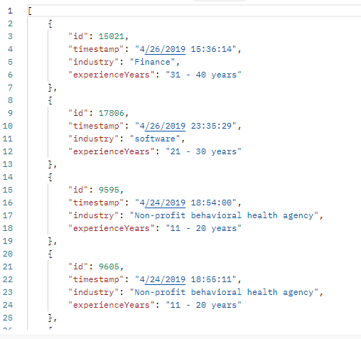
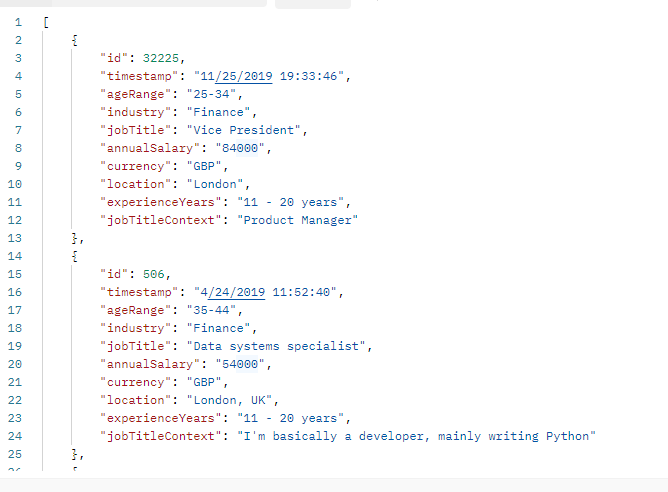

# Compensation Data API

This API provides a GET endpoint to retrieve compensation data.

* Crated a `Maven` project with using `Java 20` and `Spring 3.3` to implement this service.
* Used `H2 Database` to implement quick and easy to use DB solution.
* I used IntelliJ IDEA to implement the project. You can choose anything that runs Maven projects.
* When application starts the DB gets populated by `CSVInitializer` class. That reads the file located at the path
  decided
  by the environment property `db.file.path`
* I used `salary_survey-1.csv` to populate DB.
* I did not normalize strange values. I couldn't justify the removing all the non alpha chars. Some people gave their
  salary info with per hour suffix. Removing this indeed makes it more safe but removes the meaning of the value also.
  So I decided to no normalize. It should be stopped at the frontend to get values like this.


* Service accepts URL parameters named below and runs a query on DB according to those parameters.
* I did not implement field modifiers such as `[gte]`, `[lte]`. I couldn't come up with a clean solution. Probably
  because of my lack of skills.

## Endpoints

### GET /compensation_data

Retrieves compensation data based on specified criteria.

#### Query Parameters

- `id`: Optional. Filter by ID.
- `timestamp`: Optional. Filter by timestamp.
- `industry`: Optional. Filter by industry name.
- `jobTitle`: Optional. Filter by job title.
- `annualSalary`: Optional. Filter by annual salary.
- `currency`: Optional. Filter by currency
- `location`: Optional. Filter by location.
- `experienceYears`: Optional. Filter by experience years.
- `jobTitleContext`: Optional. Filter by job title context.
- `otherCurrency`: Optional. Filter by other currency.
- `sort`: Optional. Sort by field(s). Format: `field:direction` (e.g., `timestamp:asc`, or with multiple
  sort `id:asc,timestamp:asc`).
- `fields`: Optional. Specify fields to include in the response. Format: `field1,field2,field3`.

#### Example

* I used `Postman` to create this request. But I don't think it's necessary to test these results.

#### Request-1

```
http GET /compensation_data?jobTitle=Director&currency=USD&sort=location:desc,id:asc&fields=id,timestamp,industry,experienceYears
```

#### Response-1



#### Request-2

```
http GET /compensation_data?industry=Finance&experienceYears=11 - 20 years&currency=GBP&sort=annualSalary:desc
```

#### Response-2

